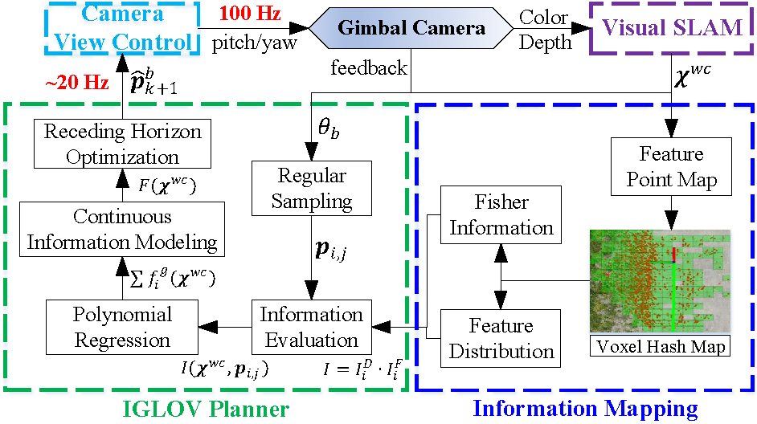

# IGLOV

# Active View Planning for Visual SLAM in Outdoor Environments Based on Continuous Information Modeling

## 1. Introduction
**IGLOV** is a approach by actively and smoothly controlling a gimbal camera equipped on the robot to realize robust and accurate SLAM in unknown outdoor environments. The main works include three-fold:
- Feature distribution-weighted Fisher information to represent the localization uncertainty of environments.
- A continuous information modeling method to map the environmental information, like localization uncertainty, into multiple polynomial functions.
- An information gradient-based local view (IGLOV) planner plans the optimal camera views in real-time for obtaining maximal environmental information.

Authors: [Zhihao Wang](https://github.com/nixwang), [Haoyao Chen](https://github.com/HitszChen) from the [Networked RObotics and Sytems Lab](http://www.nrs-lab.com), Shiwu Zhang, and Yunjiang Lou.

If you use IGLOV for your academic research, please cite the following paper [[pdf](https://arxiv.org/pdf/2211.06557.pdf)]. 
```
@ARTICLE{9830851,  
  author={Zhihao Wang, Haoyao Chen, Shiwu Zhang, Yunjiang Lou},  
  journal={IEEE Transactions on Mechatronics},  
  title={Active View Planning for Visual SLAM in Outdoor Environments Based on Continuous Information Modeling},   
  year={2023},  
  volume={},  
  number={},  
  pages={},  
  doi={}}
```
  

### 1.1. Framework

<div align="center"></div>

### 1.2. Related Video:

<div align="center">
    <a href="https://youtu.be/O2XMyuhtGVk" target="blank">
    
    </a>
</div>


**Video links:** [Youtube](https://youtu.be/O2XMyuhtGVk) or [Bilibili](https://www.bilibili.com/video/BV1co4y1w7cQ).


## 2. Installation
Tested on Ubuntu 16.04 and 18.04.

- Install ROS packages
```
sudo apt-get install ros-$(rosversion)-octomap-ros ros-$(rosversion)-octomap-msgs ros-$(rosversion)-yocs-cmd-vel-mux ros-$(rosversion)-pcl-ros
```

```
cd {YOUR_PATH}
git clone https://github.com/HITSZ-NRSL/IGLOV.git
cd IGLOV
catkin build
```

- Add Gazebo model path
```
export GAZEBO_MODEL_PATH=$YOUR_PATH$/IGLOV/src/plt1000_base/plt_gazebo/models:$GAZEBO_MODEL_PATH
```

## 3. Run examples

**Gazebo**

```bash
cd {YOUR_PATH}/IGLOV
roslaunch plt_gazebo gazebo_realsense.launch
```

**SLAM**

```bash
cd {YOUR_PATH}/IGLOV
roslaunch orb_slam_2_ros orb_slam2_d435_rgbd_realsense.launch
```

**View Planning**

```bash
cd {YOUR_PATH}/IGLOV
roslaunch view_planning view_planning.launch
```

**Robot Base**

```bash
cd {YOUR_PATH}/IGLOV/src/plt1000_base/plt_control/src
python robot_keyboard_teleop.py 
```
Then press the key 'r'(lowercase), the robot base will follow the preset trajectory.

## 5. Acknowledgments
 SLAM in **IGLOV** is based on [ORB-SLAM2](https://github.com/raulmur/ORB_SLAM2).

## LICENSE
The source code is released under GPLv3 license.